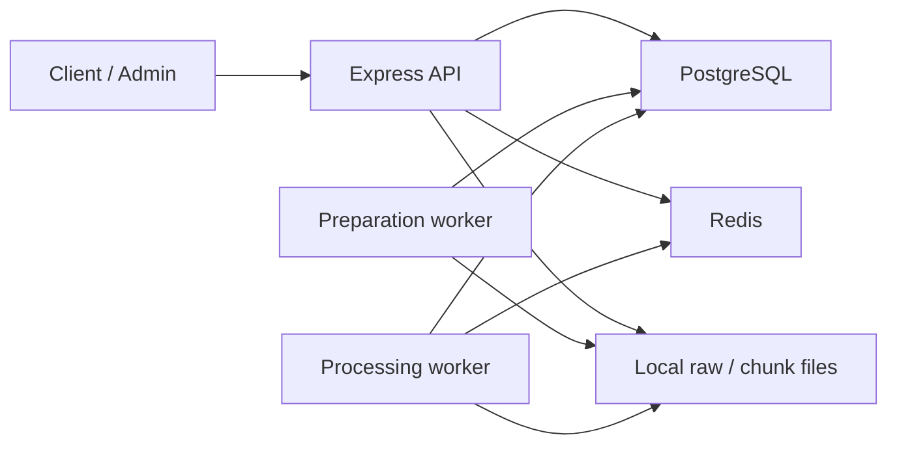

# Architecture Decision Record

## Status

Accepted for case-study implementation.

The implementation is local-first. The design considers production and serverless constraints
(timeout, memory, disposable workers, durable work state). Cloud resources are not provisioned.
PostgreSQL is the source of truth. Redis is optional for correctness. Local filesystem and
PostgreSQL-backed ImportJob/ImportChunk rows are development adapters for object storage and
managed orchestration.

## Context

ModaCo needs an internal Product and Promotion API plus two load-sensitive scenarios:

- Scenario A: weekly vendor files larger than 500,000 rows under serverless consumption-plan
  constraints.
- Scenario B: Category flash sales that can affect more than 50,000 Products while listing and
  detail endpoints take heavy read traffic.

`REQUIREMENTS.md` states the business invariants and leaves several technology choices open. This
document records the choices that were actually implemented.

## Decision summary

| # | Decision |
| --- | --- |
| 1 | Modular monolith with one-shot worker processes |
| 2 | PostgreSQL + Prisma, with parameterized raw SQL and migration-only constraints |
| 3 | Product-over-Category Promotion policy, half-open intervals, exclusion constraints |
| 4 | Effective price computed at read time, not persisted |
| 5 | Offset pagination with a capped page size |
| 6 | Streamed upload, prepared NDJSON chunks, one-chunk processing |
| 7 | At-least-once execution, fencing, retry, stale-lock recovery |
| 8 | Redis cache-aside with logical versioning and fail-open reads |
| 9 | Local Redis via Compose, local PostgreSQL, local disk, CLI workers |

## Architecture overview

The API constructs Express in `src/app.ts` and listens in `src/server.ts`. Workers reuse the same
domain and persistence modules and exit after one job or one chunk.

## Decision details

### Decision 1 — Modular monolith

The domain is one catalog with Promotions and ingestion. That does not justify independently
deployed services. A modular monolith keeps Product, Promotion, pricing, ingestion, and cache
boundaries in one process while workers stay separate one-shot commands that import the same
modules.

Rejected for this assignment:

- **Microservices.** Extra network hops, independent deploys, and distributed transactions for a
  single catalog.
- **Event-driven distributed services.** Useful later for fan-out, but they add brokers, idempotency
  keys, and local setup that the assignment does not require.

If listing reads, ingestion writes, or Promotion management need independent scale later, those
modules already have isolated entry points (`src/products`, `src/promotions`, `src/ingestion`) and
can be extracted without changing the domain model first.

### Decision 2 — PostgreSQL and Prisma

PostgreSQL was selected for ACID transactions, foreign keys, indexes, CHECK constraints, and
GiST exclusion over time ranges. Prisma provides typed access for ordinary reads and writes.
Parameterized `$queryRaw` / `$executeRaw` is used only where Prisma cannot express the operation
clearly:

- Effective-price listing: filter, compute, sort, then paginate in one SQL statement.
- Chunk Product upsert: one `INSERT ... ON CONFLICT ("sku") DO UPDATE`.
- Chunk/job claim: `FOR UPDATE SKIP LOCKED` and fencing CAS.

CHECK constraints and `btree_gist` exclusion constraints live in committed SQL migrations because
Prisma schema cannot represent them. `schema.prisma` remains the table/index source; reviewers
must also read migration SQL.

Alternatives:

- **Drizzle or a query builder.** More SQL visibility, less generated-client convenience.
- **Pure raw SQL.** Maximum control, higher maintenance cost for routine CRUD.
- **NoSQL.** Weak fit for overlapping-range integrity and relational Promotion targeting.

Trade-off: several correctness guarantees are PostgreSQL-specific and invisible in
`schema.prisma`. That is accepted for this assignment.

### Decision 3 — Promotion model and conflict resolution

Selected policy (A-01, A-02, A-06):

- A Product Promotion overrides a Category Promotion for that Product.
- Two non-cancelled Promotions may not overlap at the same Product or the same Category,
  including future schedules.
- Product and Category Promotions may overlap.
- Active interval is `[startAt, endAt)`.
- Cancelled Promotions are retained and do not participate in overlap checks.

“Greatest discount wins” was rejected. The brief does not specify it. Comparing percentage and
fixed discounts requires Product-specific arithmetic on every conflict, and the numerically
larger discount may not be the intended exception. Target specificity is cheaper to enforce and
matches explicit assignment.

Two protection layers:

1. An application pre-check inside the assignment transaction returns `409 PROMOTION_CONFLICT`
   with a stable code.
2. GiST exclusion constraints (`no_overlapping_product_promotions`,
   `no_overlapping_category_promotions`) reject concurrent winners atomically.

A `SELECT`-then-`INSERT` check alone cannot prevent two simultaneous assignments. The database
constraint is the race-condition boundary. Assignment retries once on Prisma `P2034` write
conflicts caused by deadlock breakup.

### Decision 4 — Effective price at read time

`effectivePrice` is not a Product column. It is derived from `basePrice` and the Promotion that
is active at request evaluation time. Product scope wins over Category scope. Arithmetic uses
Prisma `Decimal`, half-up to two places, floored at zero (A-05, A-07).

Category Promotions are a rule on the Category, not a snapshot of current Product IDs. Creating
or cancelling a flash sale therefore does not update 50,000 Product rows. A Product that later
enters the Category inherits the Promotion automatically.

Listing sort by effective price runs in PostgreSQL over the filtered set, then `OFFSET`/`LIMIT`.
Product `id` is the ascending tie-breaker.

Trade-off: reads are heavier than a stored price column, and effective-price sort needs the
specialized SQL in `product-effective-price.query.ts`. Query plans should be rechecked at
representative volume.

### Decision 5 — Pagination

Offset pagination is implemented (A-11 selected for this case study). Defaults are `page=1` and
`pageSize=20`, capped at 100. Order is deterministic (`id`, or effective price then `id`).

Offset is simple and sufficient for the assignment API. Deep pages become more expensive as
offsets grow. Cursor/keyset pagination is the production alternative for very large catalogs; it
is not implemented.

### Decision 6 — Scenario A: ingestion architecture

Implemented flow:

1. `POST /imports` streams one CSV to `IMPORT_STORAGE_PATH` under a server-generated UUID name
   and creates a `PENDING` ImportJob. The HTTP response is `202`.
2. `npm run ingestion:prepare` claims one job, streams the CSV, validates headers, computes
   SHA-256, and writes bounded NDJSON chunks.
3. `npm run ingestion:process` claims one available chunk with `FOR UPDATE SKIP LOCKED`.
4. Each valid row passes through the `v1` application pricing rule.
5. Categories are resolved in bulk; Products are upserted in one parameterized statement.
6. Invalid rows become `ImportFailure` records in the same transaction as successful upserts.
7. Chunk completion and job counters commit together.

The file is never loaded fully into memory. Upload does not process Products. Workers are
one-shot. Chunk size (`IMPORT_CHUNK_SIZE`, default 500) bounds parser memory and transaction
size.

Transaction boundaries:

- Claim is a short lock/update.
- NDJSON reading happens outside the Product transaction.
- Ownership CAS, Category writes, Product upserts, failures, counters, and chunk completion
  share one persist transaction.

### Decision 7 — At-least-once execution, retries, and recovery

Exactly-once execution is not assumed. A worker may crash after commit or be invoked twice.

- `attemptCount` increments on every claim and, with `lockedBy`, is the fencing token.
- Persist and failure transitions update only when `status`, `lockedBy`, and `attemptCount`
  still match.
- Crash before commit rolls back Product writes, failures, and counters.
- Crash after commit leaves a `COMPLETED` chunk that cannot be claimed again.
- Retryable Prisma/filesystem errors requeue with
  `min(baseDelay × 2^(attemptCount - 1), maxDelay)` until `IMPORT_MAX_ATTEMPTS`.
- Each process invocation recovers at most 100 stale `PROCESSING` locks older than
  `IMPORT_LOCK_TIMEOUT_SECONDS`.
- A terminal `FAILED` chunk plus a chunk-level `ImportFailure` is the local dead-letter
  representation. There is no managed DLQ.

Duplicate handling actually implemented:

- Within a chunk, the first valid SKU wins; later copies are `DUPLICATE_SKU_IN_CHUNK`.
- An existing catalog SKU is upserted (name, category, base price, stock).
- `fileChecksum` is stored after preparation and is not unique.
- Cross-chunk and cross-import last-write ordering is not a closed business rule (A-08).

Trade-off: work state lives in the same PostgreSQL instance as domain data. That removes a
queue dependency for the assignment and adds write load that a managed queue would absorb in
production.

### Decision 8 — Scenario B: Redis caching

`GET /products/:id` and listing pages `1` through `PRODUCT_LIST_CACHE_MAX_PAGE` use cache-aside.
PostgreSQL remains authoritative. Redis failure fails open.

Invalidation increments version counters after the domain write commits:

- Product Promotion assign/cancel: Product version, plus global and Category listing versions.
- Category Promotion assign/cancel: one Category promotion version, plus those listing versions.
- Ingestion upserts: affected Product versions plus listing versions. There is no Product
  create/update HTTP write path besides imports.

This is O(1) per scope, not O(affected Products). The design does not scan Redis or delete
50,000 Product keys.

Consistency is bounded eventual consistency (A-10):

- When Redis is available, version increments invalidate immediately.
- When invalidation fails, stale entries expire within the configured TTL
  (detail default 30s, listing default 15s).
- Scheduled `startAt` / `endAt` boundaries use the same TTL; no timer job exists.
- Cache fills compare versions before and after the database load and write only if unchanged.
- Single-flight is per Node process, not a distributed lock.

Rejected:

- **No cache.** Leaves the hottest detail path and flash-sale listing on PostgreSQL only.
- **Deleting all affected Product keys.** A Category sale would become a 50,000-key
  synchronous delete.
- **Persisted effective prices.** Recreates the 50,000-row write problem.
- **Cache warming and distributed locks.** Extra moving parts not required to demonstrate
  fail-open cache-aside.

### Decision 9 — Local-first infrastructure

Implemented adapters:

- Redis: `compose.yaml` (`redis:8-alpine` on port 6379).
- PostgreSQL: existing local instance via `DATABASE_URL`. Compose does not start PostgreSQL.
- Files: `IMPORT_STORAGE_PATH` (default `./data/imports`).
- Workers: `tsx` one-shot commands.
- Work state: `ImportJob`, `ImportChunk`, `ImportFailure`.

Reasons: no paid remote dependency, reproducible reviewer setup, and the same transaction
semantics as production. Local disk is not a horizontally scaled object store. Concurrent
workers on multiple hosts would need shared storage that this repository does not provide.

## Scenario A

The upload request only accepts and stores the file. Preparation splits work into durable
chunks. Processing applies pricing rules in bounded units that can finish inside a serverless
timeout. Progress survives process death. Retries and fencing keep at-least-once delivery from
double-applying a completed chunk.

## Scenario B

A Category Promotion is one row. Reads compute effective price. Cache versions invalidate
logically. New Products in the Category pick up the sale without a backfill write. Redis down
does not take the API down.

## Trade-offs and alternatives

Covered under each decision. The recurring theme is: prefer one PostgreSQL system of record and
disposable workers over a distributed platform that the assignment does not require.

## Assumptions

Statuses below distinguish **implemented defaults** from **business-confirmed** rules.
ModaCo has not superseded these in-repo.

| ID | Item | Status in this implementation |
| --- | --- | --- |
| A-01 | Product Promotion overrides Category; same-scope overlaps rejected | Implemented; still a selected assumption |
| A-02 | Active interval `[startAt, endAt)` | Implemented |
| A-03 | Timestamps stored/compared in UTC; API uses ISO 8601 with offset/`Z` | Implemented |
| A-04 | Percentage `(0, 100]` | Implemented in validation and CHECK |
| A-05 | Effective price floored at zero | Implemented |
| A-06 | Soft, auditable cancellation | Implemented |
| A-07 | Decimal-safe money | Implemented (`Decimal(12, 2)`, Prisma Decimal) |
| A-08 | Duplicate-file / cross-import SKU policy | **Open.** Checksum is non-unique; last upsert wins per processed row |
| A-09 | Invalid-row policy | **Open as business confirmation.** Code isolates invalid rows and keeps valid rows in the same chunk transaction (partial success). Whole-file rejection is not implemented |
| A-10 | Bounded cache eventual consistency | Implemented and documented |
| A-11 | Pagination style | **Implemented as offset.** Cursor/keyset not built |
| A-12 | Authentication | **Out of case-study scope.** Production must authorize management and ingestion |

## Known limitations

- `AI_APPENDIX.md` is still absent (required by `REQUIREMENTS.md`, outside this document).
- ImportJob enum includes `CANCELLED` with no cancel-import API.
- Compose does not provide PostgreSQL.
- Redis single-flight is process-local.
- 500,000-row processing and 50,000-product read load were not measured; see
  [PERFORMANCE.md](PERFORMANCE.md).
- Local filesystem cannot be the production sharing model for many workers.

## Production mapping

Design mapping only. Nothing below is deployed.

| Local implementation | Production mapping |
| --- | --- |
| Local raw/chunk files | Object storage (S3 or Azure Blob) |
| PostgreSQL work-state + CLI invoke | Managed queue / orchestration (SQS, Service Bus, or equivalent) |
| One-shot Node worker | Serverless function (Lambda or Azure Functions) |
| Local PostgreSQL | Managed PostgreSQL |
| Compose Redis | Managed Redis |

Serverless constraints already reflected in the local design: bounded chunks, no reliance on
the upload HTTP request finishing the import, durable job/chunk state, fencing for at-least-once
delivery, and fail-open cache. Production would still need connection pooling or a proxy,
bounded worker concurrency, and authentication.

No cloud vendor is selected.

## Security and operations

Implemented:

- Request validation and parameterized SQL
- Upload size, type, empty-file, and single-file limits
- Server-generated stored names and path containment under `IMPORT_STORAGE_PATH`
- Sanitized HTTP errors (no stacks, SQL, paths, or connection strings)
- Graceful `SIGTERM`/`SIGINT` with Prisma and Redis cleanup
- Redis fail-open

Intentionally not implemented: authentication, authorization, rate limiting, WAF, or centralized
audit logging. Secrets belong in environment or secret storage, not source control. Promotion
and ingestion endpoints must sit behind authn/authz in production (A-12).

## Performance evidence

See [PERFORMANCE.md](PERFORMANCE.md).

Measured in the recorded local environment:

- 500,000-row CSV generation (28.0 MB, 429 ms, peak RSS 106.6 MB)
- 50-row real ingestion path (1 chunk, `COMPLETED`, 0 retries)
- 20-product flash-sale seed and an `EXPLAIN` of the production listing SQL

Not measured: 500,000-row prepare/process, 50,000-product seed, and `perf:read` cold/warm/fallback
load. Those local Docker figures, if collected later, would still be comparative evidence, not
production capacity.

## Consequences

| Decision | Benefit | Cost / limitation |
| --- | --- | --- |
| Prisma + PostgreSQL-specific SQL | Typed CRUD plus correct listing/upsert/claim | Constraints live outside `schema.prisma` |
| Read-time pricing | Flash sale is one row; new Products inherit it | Heavier reads; specialized sort SQL |
| Offset pagination | Simple, deterministic API | Deep pages cost more; no cursor API |
| PostgreSQL work state | Durable progress without a queue | Extra write load on the catalog database |
| Local filesystem | Easy local review | Not shared-worker object storage |
| Versioned Redis cache | O(1) Category invalidation; fail-open | Bounded staleness; process-local single-flight |
| Short TTL | Scheduled boundaries without timers | Brief stale reads after start/end |
| One-shot workers | Serverless-shaped execution | Needs an external invoker in production |
| A-08 / A-09 open | Honest about unspecified policy | No file-wide dedup or all-or-nothing import |

## Rejected alternatives

| Alternative | Why it was not used |
| --- | --- |
| NestJS | The brief asks for Express |
| Microservices | Domain size and local operational cost |
| Updating 50,000 Product rows for a Category sale | Write amplification; breaks automatic membership |
| Processing 500,000 rows in `POST /imports` | Violates serverless timeout/memory and HTTP lifecycle |
| Loading the full vendor file into memory | Unbounded RSS on large CSVs |
| One database query per ingested row | N+1 write path inside a 500-row chunk |
| Redis as source of truth | Cache loss would corrupt reads |
| Scanning/deleting 50,000 cache keys | Synchronous invalidation hotspot |
| Kafka, Kubernetes, or LocalStack | Extra platform not needed to prove the design |
| Full cloud deploy for the assignment | Out of scope; mapping is documented instead |

## Consequences for reviewers

The code is the contract. This ADR explains why the implemented shape looks like a small
modular monolith with disposable workers and an optional cache, not a cloud topology diagram.
